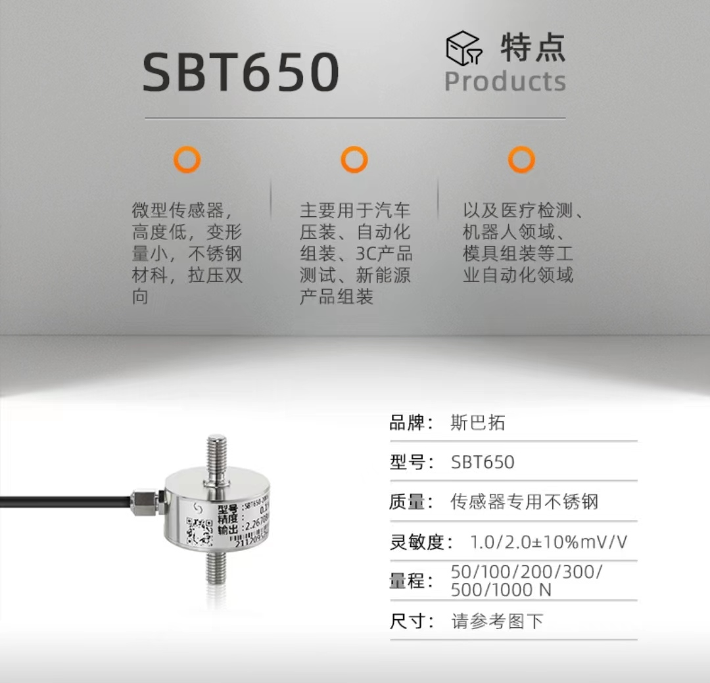
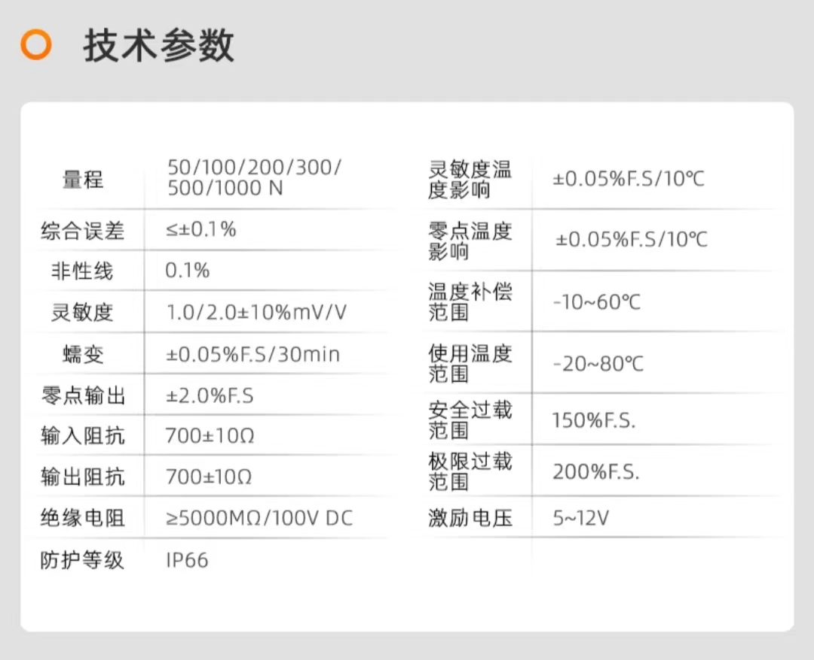
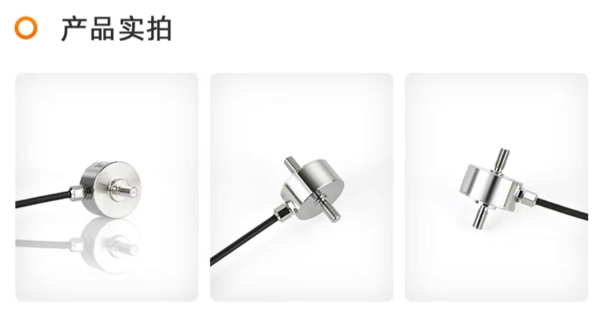
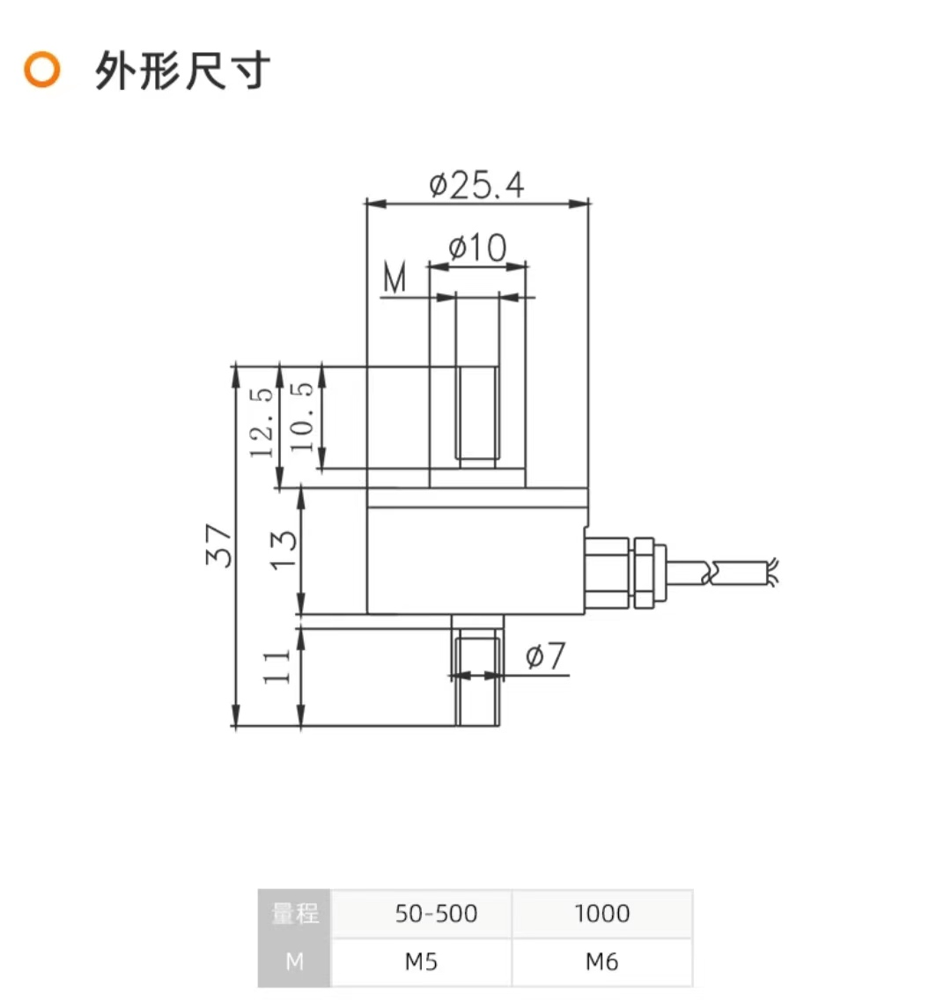
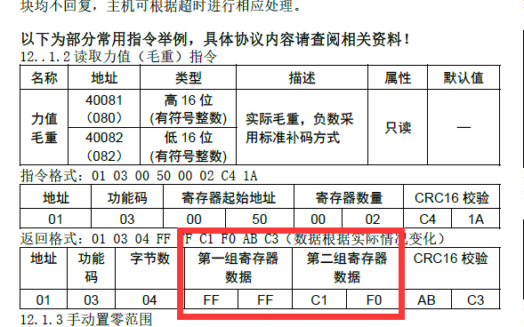

# 力传感器处理与可视化软件

## 传感器信息
| 品牌 | 斯巴拓(拉压力传感器) |
| ---- | -------------------- |
| 型号 | SBT650-50N           |
| 量程 | 50N                  |
| 输出 | 1.67439mV/V          |
| 精度 | 0.1%                 |
| 编码 | DG020016             |

    

    

    

    

## 传感器连接与使用
传感器通过SBT904-A1变送器将信息放大后通过RS485串口输出数据, 可通过RS485-USB转换模块与电脑连接

信息格式
> 第一组寄存器代表是拉力还是压力 (第4,5位是FF FF则是拉力，00 00则是压力)
> 
> 第二组寄存器代表数值 (单位是g, 约0.01N)
>
> 注意拉力传回来是补码, 要进行转换

    

